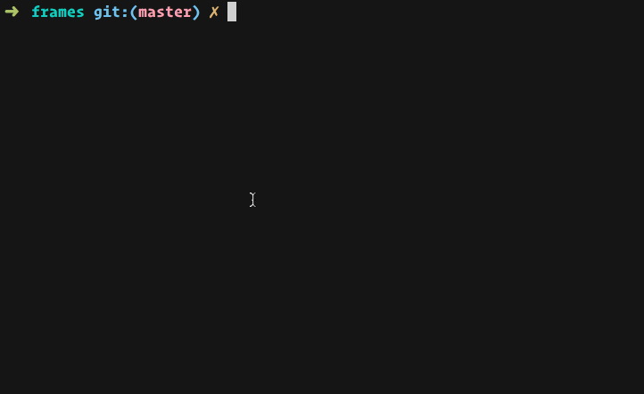

# sq - Magical File Grouping



`sq` finds and groups sequence of file runs that naturally belong together.
With `sq` you can:

* Get rid of that huge downloads folder, by automatically grouping files along
  your download sprees.
* Save time organizing photoshoots by placing shots that were made around the
  same time together.
* Stitch a huge list of security camera detection frames into movies or simple gifs.

And more.

## Quick Start

If you're on OSX, then:

```
$ brew tap jondot/tap
$ brew install sq
```

Otherwise, you can grab a binary from the [releases page](https://github.com/jondot/sq/releases).

You can then proceed to run `sq` on a sample directory. Don't worry, by default
it will only *show* you what it wants to do, and it won't actually do it.

```
$ cd ~/Downloads
$ sq -g '*.*' -d 100
```

Explore how `sq` have created groups, by separating groups of files that are
more than `-d 100` seconds apart. Makes sense? now let's see what you can do
with it.


## Distance

The concept of **distance** is very important for `sq`. It separates groups by their
natural distance; it can be file time, exif date, or anything it can parse into
a number from a file name (see the `--format` and `--layout` flags).

## Examples

### Sorting Media

Let's say you download legal videos every now and then through RSS feeds. You'd like
to bunch up all movies and TV series that were downloaded the same day. Here we go:

```
$ cd /downloads
$ sq -d 3000 -g '*.avi' -m
```

This globs `avi` files, and moves (`-m`) them
under their groups. Every group has a name which
correspond to the first file in that group,
headed by a `group_` prefix (you can change this
with `-p`).

### Automating Photoshoot Workflow

If you're a photographer, then much of your time is spent juggling files from
various media. You can transform a long list of files into a more informative one,
that groups your shooting sessions into folders:

```
$ cd storage
$ sq -d 1800 -g '*.*' --exif -c
```

This will create new groups, and *copy* files into them. When dealing with
photography, we want to copy and not move files regardless of which software we
use; a photo lost is a moment you can never recreate.


### Making Videos

If you have a security camera with a movement detection feature, then it will spit out
detection frames now and then. Folders will tend to fill up with detection frames,
and it's a lot cooler to just send yourself, or your customers, videos of detections:

```
$ sq -d 300 -g '*.*' -t -c -s --group-command 'ffmpeg -framerate 2 -i "{{GROUP}}/%d.jpg" -c:v libx264 {{GROUP}}.avi'
```

This shows an advanced use case: `--group-command` which takes a command `sq`
runs on each group, the `{{GROUP}}` template variable that will be used to
inject the group name (or location), and `-s` which will *sequence* the files;
meaning will rename them per group with an increasing number - which makes it
easy for `ffmpeg` to glob with `%d`.

Note that with `ffmpeg` you can also glob by a free file name and make a
different format of a video:

```
$ ffmpeg -f image2 -pattern_type glob -i '*.jpg' out.avi
```


# Contributing

Fork, implement, add tests, pull request, get my everlasting thanks and a respectable place here :).


# Copyright

Copyright (c) 2015 [Dotan Nahum](http://gplus.to/dotan) [@jondot](http://twitter.com/jondot). See MIT-LICENSE for further details.


